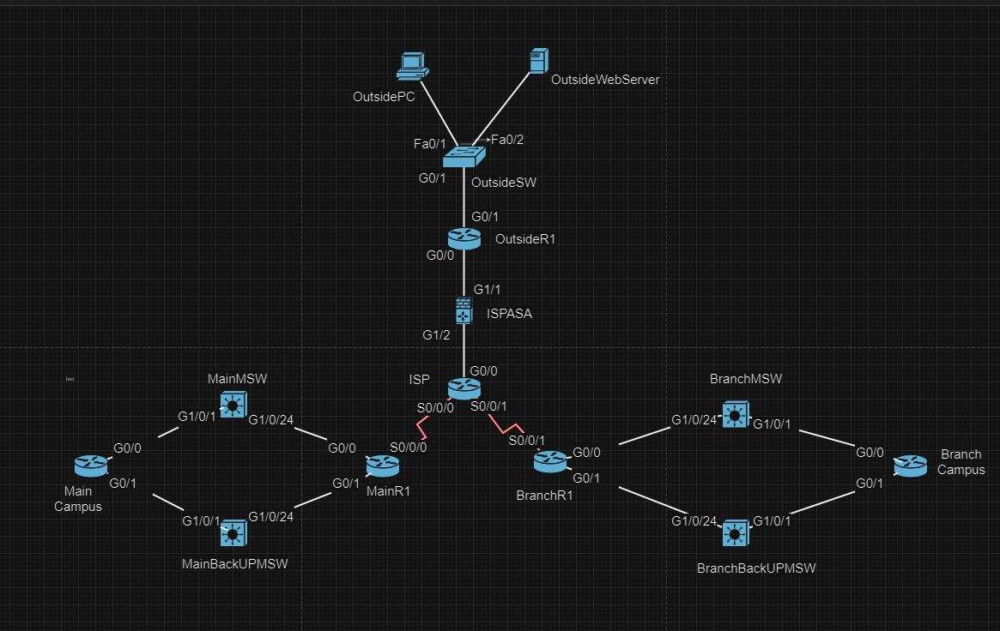
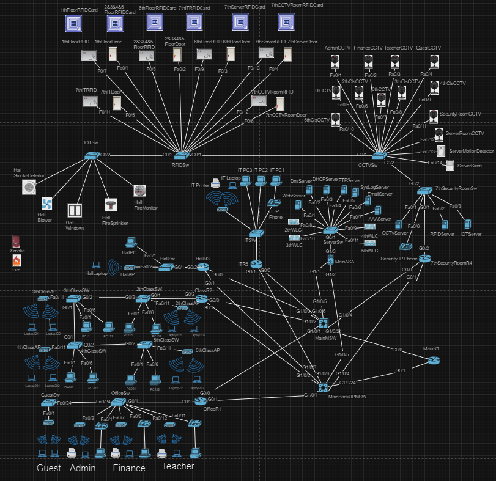
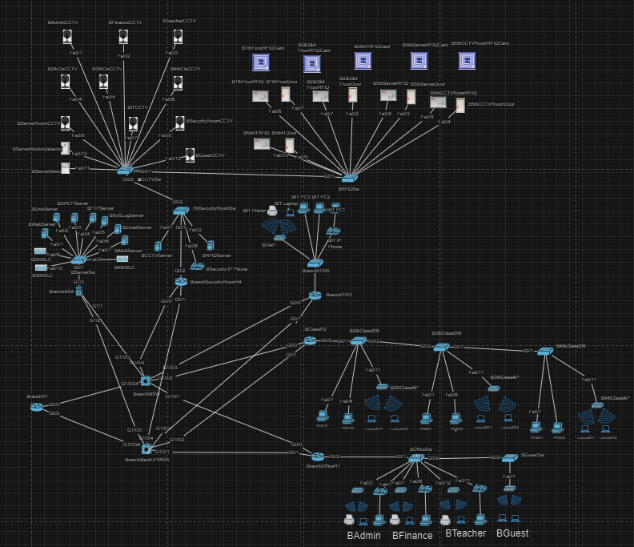

# University Network Design

## Overview

This project is my **Diploma Final Year Project**.

The objective of this project is to design and simulate a **secure and scalable university network** using **Cisco Packet Tracer**.

The network consists of:

- Main Campus (7 Floors)
- Branch Campus (5 Floors)

The design supports approximately **5,000 users**, including around **4,200 students** and **800 faculty and staff members**.

The project focuses on network architecture design, security implementation, and enterprise network services simulation.

---

# Technologies & Features

## Routing & Switching

- VLAN Segmentation
- Inter-VLAN Routing
- EIGRP Dynamic Routing
- DHCP Configuration
- NAT Configuration

## Network Security

- Cisco ASA Firewall
- Access Control List (ACL)
- AAA Authentication
- SSH Remote Management
- Site-to-Site VPN (IPsec/GRE)

## Network Services

- DHCP Server
- DNS Server
- FTP Server
- Email Server
- Web Server
- Syslog Server

## Wireless & Communication

- Wireless LAN Controller (WLC)
- Access Point Management
- IP Phone System
- Telephony Service

## Smart Campus

- CCTV Surveillance System
- RFID Door Access System

---

# Network Topology

---

# Main Campus

---

# Branch Campus

---

# Project Files

| File | Description |
|------|-------------|
| `Final Year Project.pkt` | Cisco Packet Tracer simulation file |
| `Final Year Project Report.pdf` | Complete project documentation |
| `Final Year Project Presentation.pdf` | Project presentation slides |

---

# Skills Demonstrated

- Cisco Networking
- VLAN & Routing
- EIGRP
- ACL & Firewall Security
- VPN Configuration
- Network Services Deployment
- Wireless Network Design
- Network Troubleshooting

---

# Author

**Lee Han Liang**

Cybersecurity & Networking Graduate

Diploma Final Year Project  
**University Network Design using Cisco Packet Tracer**
